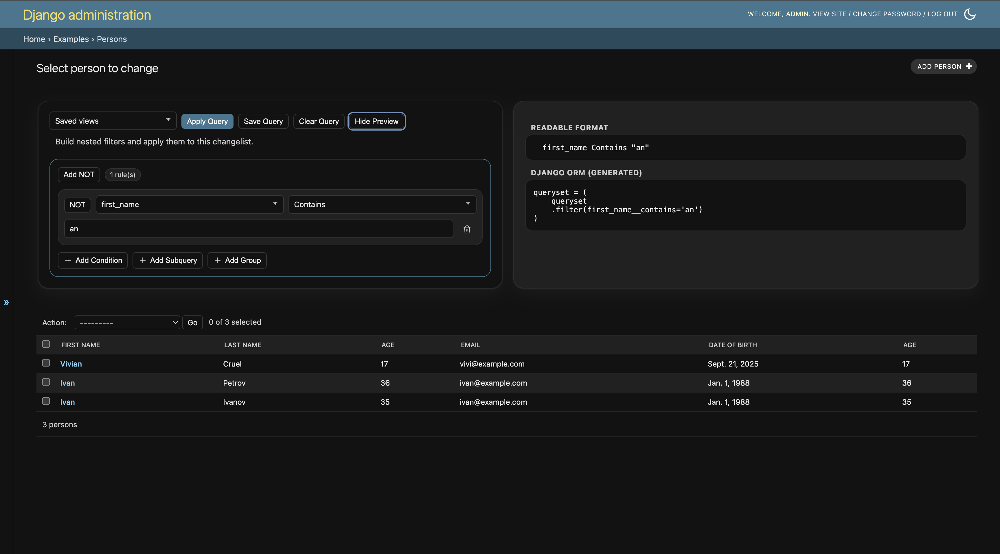
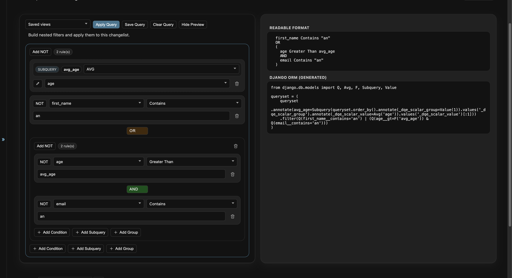
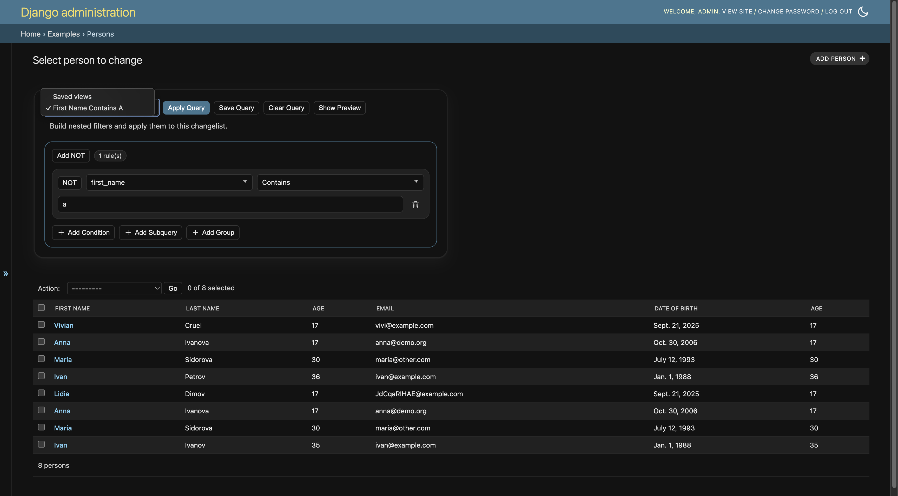

# Django Easy Query Builder

`django-easy-query-builder` is a Django admin extension that adds a safe, UI-driven advanced query builder to changelist pages.

It lets admins build nested filters visually, serialize them into URL parameters, validate them server-side, and execute them as Django ORM queries.

## Why This Project

Django admin search is great for simple use cases, but it gets limiting when users need:

- multiple nested `AND` / `OR` / `NOT` groups
- related-model filtering across deep relations
- reproducible filter URLs
- reusable saved query views

This package provides that out of the box with a mixin.

## Features

- Drop-in `ModelAdmin` mixin (`AdvancedSearchAdminMixin`)
- Declarative field allowlist (`advanced_search_fields`)
- Safe parser and strict schema validation
- Nested groups and logical operators
- Support for common Django lookups (`exact`, `icontains`, `gt`, `range`, `isnull`, etc.)
- Relation traversal via `__` paths
- Subquery support (`exists` / `not_exists`)
- URL-based query payloads
- Saved query views in admin UI
- Backend-first test coverage

## Screenshots (Placeholders)

Replace these placeholders with your real screenshots.

### Query Builder Panel



_Placeholder: main changelist page with query builder UI._

### Nested Group Example



_Placeholder: example with nested `AND` / `OR` groups and relation filters._

### Saved Views Dropdown



_Placeholder: saved query selection and apply flow._

## Installation

Install with whichever tool you use:

```bash
pip install django-easy-query-builder
```

```bash
poetry add django-easy-query-builder
```

```bash
uv add django-easy-query-builder
```

## Quick Start

1. Add the app to `INSTALLED_APPS`:

```python
INSTALLED_APPS = [
    # ...
    "django_easy_query_builder",
]
```

2. Use the mixin in your admin:

```python
from django.contrib import admin
from django_easy_query_builder.mixins import AdvancedSearchAdminMixin

from .models import Car


@admin.register(Car)
class CarAdmin(AdvancedSearchAdminMixin, admin.ModelAdmin):
    advanced_search_fields = [
        "model",
        "year",
        "manufacturer__name",
        "manufacturer__country__name",
    ]
```

That is enough to enable the query builder UI on that admin changelist.

## Configuration

### `advanced_search_fields`

Only fields listed here are queryable. This is the core security boundary.

Examples:

- direct field: `"model"`
- relation field: `"manufacturer__name"`
- deep relation field: `"manufacturer__country__name"`

### `advanced_search_lookups` (optional)

Default is all supported lookups (`["__all__"]`).
You can restrict them:

```python
advanced_search_lookups = ["exact", "iexact", "icontains", "gt", "lt"]
```

### URL parameters

- query payload: `advanced_query`
- saved view selection: `saved_view`

## Query Payload

The frontend sends a structured JSON payload through `advanced_query`.

Example:

```json
{
  "logicalOperator": "AND",
  "conditions": [
    { "field": "manufacturer.country.name", "operator": "equals", "value": "Germany" },
    { "field": "year", "operator": "greater_than", "value": "2018" }
  ],
  "groups": [],
  "negated": false
}
```

The backend parses this payload into a validated query tree, then builds Django `Q` objects safely.

## Security Model

This package is designed as a zero-trust parser:

- no raw SQL
- no `eval`
- no arbitrary field access
- operator whitelist enforced
- strict schema key validation
- unknown structures rejected early
- ORM-only query construction (`Q`, `Subquery`, `OuterRef`)

## Saved Views

Users can save and reuse advanced queries from admin.

- save endpoint is exposed under admin model URL: `.../save-query/`
- payloads are canonicalized and hashed
- duplicate query hashes are deduplicated per model
- usage metadata (`usage_count`, `last_used_at`) is tracked

## Development

Install local dependencies and run tests:

```bash
pytest -q
```

Set up pre-commit hooks:

```bash
pip install pre-commit
pre-commit install
```

## Project Structure

- `django_easy_query_builder/` package source
- `tests/` backend and admin integration tests
- `examples/` demo models/admin setup for local testing

## Compatibility

- Python 3.10+
- Django 4.2+

## License

Add your preferred license file (`LICENSE`) before publishing publicly.
